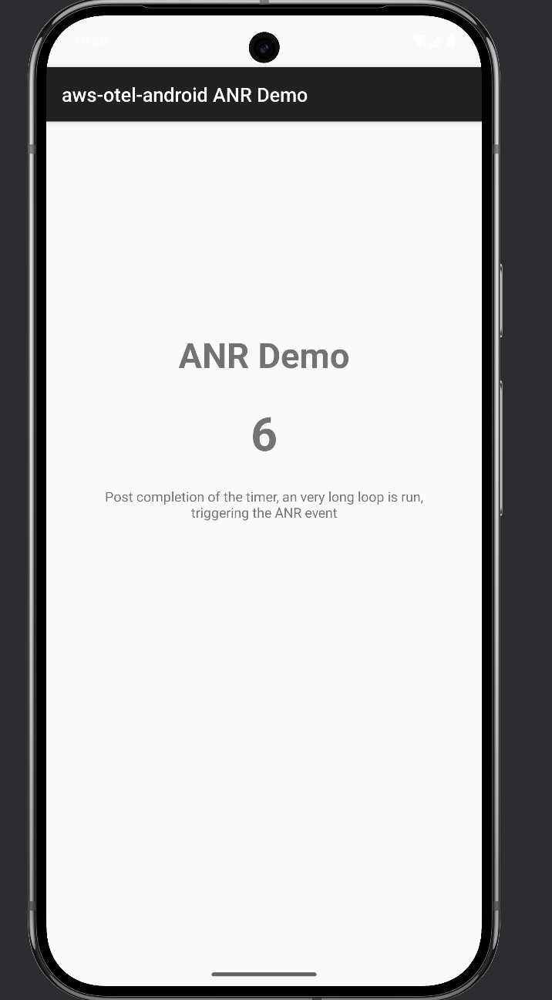

# ANR Demo App

This demo application demonstrates how to capture Application Not Responding (ANR) events using the AWS Distro for OpenTelemetry Android instrumentation.

## How it works

1. When the app starts, a 30-second countdown timer begins
2. After the timer completes, a very long loop is run that should trigger an ANR.
3. The ANR will be captured by the OpenTelemetry instrumentation and sent to your configured backend

## Implementation Details

This app uses the AWS Distro for OpenTelemetry Android agent to automatically detect and report ANR events. The main thread blocking is implemented using a long loop that is run post the timer of 10 seconds. It simulates a heavy operation on the main thread

