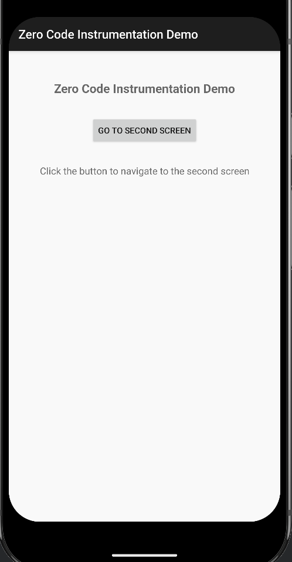
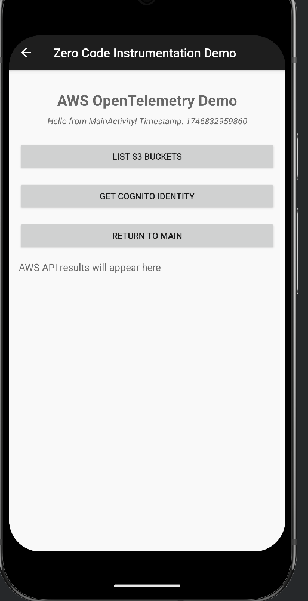

# Zero Code Instrumentation Demo

This is a simple Android application that demonstrates zero-code instrumentation with AWS OpenTelemetry for Android.

## Overview

This application contains two activities: a main activity with a button that navigates to a second activity. The app is configured to work with the zero-code-agent module for automatic instrumentation.

## Features

- Simple UI with a button to navigate between activities
- Demonstrates automatic instrumentation without manual code changes
- Follows the same configuration pattern as the simple-aws-demo app
- Shows activity transitions for telemetry tracking

## Setup

1. Make sure you have the required Android SDK versions installed
2. Build the project using Gradle
3. Run the application on an emulator or physical device
4. Replace the placeholder values in the `SecondActivity.kt` file and `aws_config.json` in the `main/res/raw` folder

## Project Structure

- `MainActivity.kt`: The main activity with navigation to the second activity
- `SecondActivity.kt`: A second activity with AWS functionality
- `ZeroCodeInstrumentationDemoApplication.kt`: Application class for initialization
- `AwsService.kt`: Service class for AWS operations

## Dependencies

- AWS OpenTelemetry for Android
- AWS SDK for Kotlin
- AndroidX libraries
- Kotlin Coroutines
